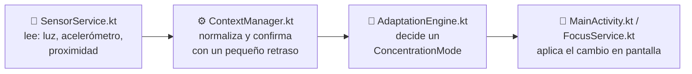

# Guía de funcionamiento — FocusTo

Esta guía explica **cómo funciona la app por dentro**, en lenguaje simple, para que cualquiera del equipo pueda entenderla y explicarla en la sustentación (el profesor puede pedir explicar el flujo de ejecución o predecir qué pasa si algo cambia).

Para instrucciones de instalación ver [README.md](README.md). Para el detalle formal del taller ver [DOCUMENTO_TECNICO.docx](DOCUMENTO_TECNICO.docx).

---

## 1. La idea en una frase

Mientras estudiás con el Pomodoro corriendo, el celular **te está "mirando" todo el tiempo** (luz, movimiento, posición) y reacciona solo, sin que toques nada.

---

## 2. Qué pasa cuando abrís la app

```
MainActivity.onCreate()
  ├─ Arma las vistas (botones, textos)
  ├─ Crea el ContextManager y el SensorService   → arrancan a "escuchar" el celular
  └─ Restaura el estado anterior (si venís de rotar la pantalla)
```

Desde este momento, **aunque no hayas apretado ningún botón**, los sensores ya están mandando datos. Lo que todavía no pasa es el bloqueo de apps ni el Pomodoro — eso arranca solo cuando tocás **"INICIAR"**.

---

## 3. El pipeline adaptativo, paso a paso (con los números reales)

Este es el corazón del proyecto — la parte que el enunciado pide explicar con más detalle.



**Paso 1 — Captura (`SensorService.kt`)**
Cada vez que el sensor del celular detecta un cambio (luz, aceleración, proximidad), este archivo lo recibe crudo, sin interpretarlo. También calcula la **inclinación** del teléfono (0° = boca arriba, 180° = boca abajo) usando el acelerómetro.

**Paso 2 — Procesamiento (`ContextManager.kt`)**
Los datos crudos son ruidosos (parpadean todo el tiempo), así que acá se los "calma":
- Si la luz está por debajo de **12 lux** durante **1 segundo seguido** → se considera "oscuro estable" (evita que una sombra momentánea active el modo nocturno por error).
- Si el teléfono queda boca abajo (inclinación > 150°) durante **1.5 segundos seguidos** → se confirma el "Modo Estudio Físico".
- Guarda también cuándo fue el último toque del usuario en pantalla (para saber si "está leyendo activamente").

**Paso 3 — Decisión (`AdaptationEngine.kt`)**
Con los datos ya confirmados, decide **una sola cosa a la vez** (por orden de prioridad, la primera condición que se cumple gana):

| Orden | Condición | Resultado (`ConcentrationMode`) |
|---|---|---|
| 1 | Aceleración > 15 (agitación fuerte) | `COOL_DOWN_LOCK` |
| 2 | Inclinación > 150° (boca abajo) | `DEEP_FOCUS` |
| 3 | Inclinación < 15° y sin movimiento (boca arriba, quieto) | `FACE_ABSENT` |
| 4 | Proximidad < 4 cm (muy cerca de la cara) | `TOO_CLOSE` |
| 5 | Inclinación entre 15° y 45° (postura floja) | `BAD_POSTURE` |
| 6 | Ninguna de las anteriores | `NORMAL` |

*(Nota: el modo nocturno se decide aparte, con su propia regla de luz — no compite con esta tabla.)*

**Paso 4 — Adaptación (`MainActivity.kt` / `FocusService.kt`)**
Convierte esa decisión en algo visible:
- `COOL_DOWN_LOCK` → tapa la pantalla con "¡Concéntrate!" y pausa el Pomodoro.
- `DEEP_FOCUS` (con PDF abierto) → banner verde "Enfoque profundo".
- `DEEP_FOCUS` (sin PDF) → vibra y activa el "Modo Estudio Físico".
- `FACE_ABSENT` → pausa automática con aviso.
- `TOO_CLOSE` / `BAD_POSTURE` → banner rojo de alerta.
- `NORMAL` → no muestra nada.

**Pregunta típica de sustentación:** *"¿Qué pasa si agito el celular mientras está boca abajo?"* → Mirá la tabla: la agitación (orden 1) gana siempre sobre boca abajo (orden 2), porque `AdaptationEngine.kt` evalúa las condiciones en ese orden y devuelve apenas encuentra la primera que se cumple.

---

## 4. El Pomodoro, paso a paso

```
Usuario toca "INICIAR"
  → MainActivity le pide a FocusViewModel que marque "corriendo"
  → MainActivity le manda un mensaje a FocusService (arranca el cronómetro real)
  → FocusService cuenta 25:00 hacia atrás, un segundo a la vez
      → cada segundo, le avisa a MainActivity (por eso el número en pantalla se actualiza)
      → cada 2 segundos, revisa si hay una app distractora abierta encima
  → Al llegar a 00:00, FocusService avisa "terminé"
      → MainActivity arranca automáticamente el descanso de 5:00
      → al terminar el descanso, vuelve al estado inicial
```

**¿Por qué el cronómetro vive en `FocusService` y no en `MainActivity`?** Porque `FocusService` es un *Foreground Service*: sigue corriendo aunque apagués la pantalla o cambies de app. Si el cronómetro viviera solo en la pantalla, se cortaría apenas la Activity se pausa.

---

## 5. El visor de PDF

```
Usuario toca "Abrir PDF" → elige un archivo → MainActivity:
  1. Copia el PDF a una carpeta temporal de la app
  2. Lo abre con PdfRenderer (API nativa de Android)
  3. Dibuja la página actual como una imagen (en segundo plano, para no trabar la pantalla)
  4. Si el modo nocturno está activo, invierte los colores de esa imagen antes de mostrarla
```

Mientras hay un PDF cargado, la app **no** activa el "Modo Estudio Físico" (asume que estás leyendo el PDF, no un libro físico).

---

## 6. El bloqueo de apps distractoras

```
FocusService, cada 2 segundos (solo durante una sesión de estudio, no en el descanso):
  → pregunta al sistema "¿qué app estuvo en primer plano hace un momento?"
  → si esa app está en la lista negra (TikTok, Instagram, YouTube, WhatsApp, etc.)
  → relanza FocusTo al frente con un aviso de bloqueo
```

---

## 7. Preguntas frecuentes para la sustentación

**"¿Dónde se detecta el contexto?"** → `SensorService.kt`

**"¿Dónde se toma la decisión?"** → `AdaptationEngine.kt` — es una clase sin ninguna dependencia de Android, solo lógica pura, por eso es fácil de testear.

**"¿Cómo probarían esto sin abrir la app 50 veces?"** → Mencionar `FocusViewModelTest.kt`: prueba el estado (Pomodoro, PDF, alertas) sin necesitar sensores reales ni un dispositivo.

**"¿Qué pasa si roto la pantalla mientras el Pomodoro corre?"** → Antes se perdía el estado (bug real que corregimos). Ahora `FocusViewModel.kt` guarda el estado de la UI y sobrevive a la rotación; el cronómetro real de todas formas nunca se perdía porque vive en `FocusService`, no en la pantalla.

**"Modifiquen X y díganme qué pasa"** → Antes de tocar código, ubicá primero en qué etapa del pipeline cae el cambio pedido (¿es un nuevo sensor → `SensorService`? ¿una nueva regla → `AdaptationEngine`? ¿una nueva reacción visual → `MainActivity`?). Eso es literalmente lo que evalúa el "Reto Técnico" del taller.
